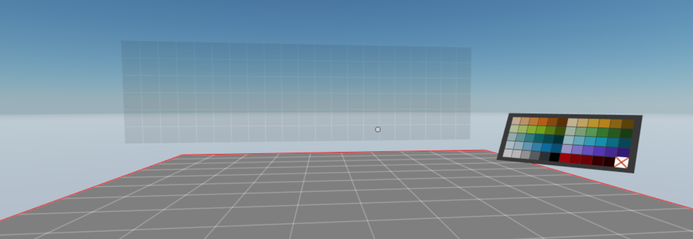
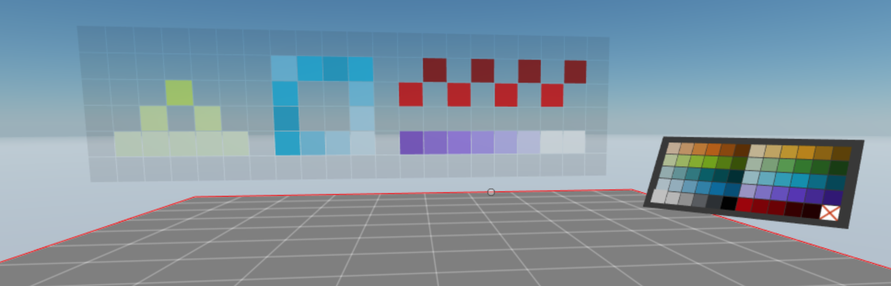
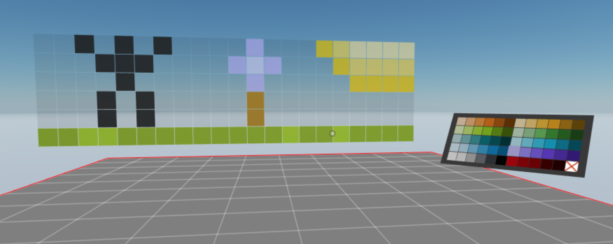

# sample-sync-rest

It's a [Decentraland](https://decentraland.org) scene to demonstrate how to incorporate an HTTP-REST API.







[Docs](./docs)
+ [The Build System](./docs/build-system.md)

## Install

```sh
# clone to your machine
git clone https://github.com/tcrowe/sample-sync-rest.git
cd sample-sync-rest
```

## Run the scene preview

```sh
cd scene

# install node dependencies
npm install

# start the preview
npm start
```

## Run the REST server

(In another terminal window)

```sh
cd server

# install node dependencies
npm install

# start the server
npm start
```
## Contribute

## Contribute

If you notice that I've made an affront to correct TypeScript coding practices please forgive.

Others will want to use this as an example or starting place to fork from. If you see room for improvement please fork, mod, and send back here in a PR.

Thank you! 🤗
